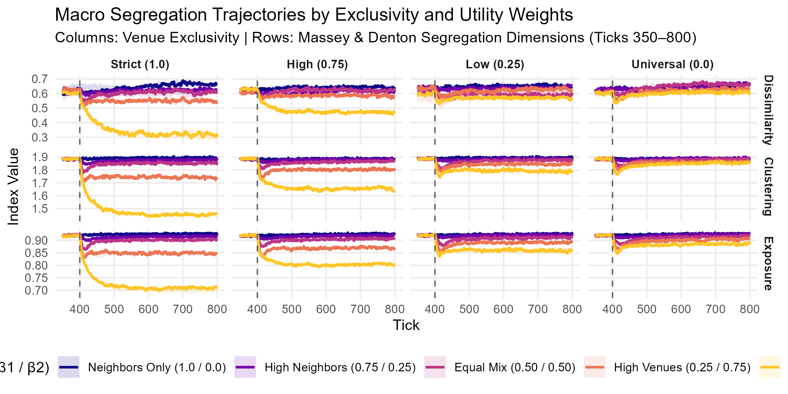

## The Illusion of Simple Fixes {.smaller}

::: {.columns}
::: {.column width="55%"}
### Segregation as an Emergent Trap
* Residential segregation emerges from a combination of structural and behavioral mechanism:
* 
* Intuitive spatial fixes often trigger **unintended consequences**[cite: 2, 3].
* *Historical precedent:* 1970s Boston school busing aimed to force desegregation overnight; it catalyzed suburban white flight and rapid re-segregation[cite: 3].
* Spatial amenities ("third places") shape opportunity structures, but how do they interact with residential choice[cite: 1, 2]?
:::

::: {.column width="45%"}
> *"The writer points to real, concrete things so the reader can see them clearly."*
> 
> When policies attempt to mechanically shift populations without addressing underlying utility, the emergent system pushes back[cite: 2, 3].
:::
:::

::: {.notes}
When public debates tackle residential segregation, the default assumption is that there must be an intuitive, mechanical fix. But segregation is an emergent macro pattern driven by micro choices. In the 1970s, Boston attempted court-ordered school busing to desegregate schools overnight. The result was severe backlash, white flight, and rapid re-segregation. When we treat complex spatial systems as simple mechanical puzzles, well-intentioned interventions backfire. Today, we investigate what happens when we manipulate urban opportunity structures through everyday amenities.
:::

---

## Analytical Framing: Coleman's Boat {.smaller}

Connecting macro urban policy interventions to aggregate segregation indices through micro decision rules[cite: 2, 3].

::: {.columns}
::: {.column width="50%"}

:::

::: {.column width="50%"}
### Definitions & Core Question
* **Segregation:** Group separation measured across unevenness, exposure, and clustering[cite: 1, 2].
* **Venues ("Third Places"):** Everyday non-work destinations (cafés, parks, hubs) with defined catchments and social utility[cite: 1, 2].
* **Research Question:** Does altering local amenity structures mitigate or entrench residential segregation[cite: 1, 2]?
:::
:::

::: {.notes}
To unpack this analytically, we use Coleman’s boat. A policy does not move people directly; it alters the spatial environment. Individual households calculate their personal utility based on that environment and make localized relocation choices. Macro segregation—measured via dissimilarity, exposure, and clustering—is the aggregate outcome. Our core question asks whether changing the availability of third places mitigates or inadvertently deepens residential segregation.
:::

---

## Model Architecture: Space as a Layered Network {.smaller}

::: {.columns}
::: {.column width="50%"}
### Extending Schelling
* **Street Networks:** Connected paths define local neighborhood interaction[cite: 1, 2].
* **Highways as Barriers:** Function as structural breaks cutting across ties[cite: 1, 2].
* **Venues as Anchors:** Third places offer social utility based on catchment radius and group match[cite: 1, 2].
* **Relocation Rule:** Bottom 10% least satisfied agents move each tick to open vacancies[cite: 1, 2].
:::

::: {.column width="50%"}
### Agent Utility Formulation
$$\text{Utility} = \frac{\sum (\beta_i \cdot \text{Attribute}_i)}{\sum \beta} + \epsilon$$

* $\beta_1$: Residential neighbors[cite: 2]
* $\beta_2$: Venue group match[cite: 2]
* $\beta_3 \dots \beta_6$: Road access, parks, distance[cite: 2]
:::
:::

::: {.notes}
Classic Schelling models place agents on an isotropic checkerboard where residential neighbors are the only consideration. We extend this by modeling space as a layered network. Following Roberto, street networks define contiguous neighborhoods, while highways act as social barriers. Following Silver and Adler, venues act as anchors providing distinct utility. At each tick, agents evaluate their total utility, and the bottom 10% relocate. We keep homophilic preferences fixed and alter the spatial opportunity structure.
:::

---

## The Tale of Two Scales: Meso vs. Macro {.smaller}

::: {.columns}
::: {.column width="55%"}
### Localized Placement (Ticks 400–550)
* **Intervention:** Single venue added at tick 400; matched pair at tick 500[cite: 1].
* **Macro Indices:** Clustering, Dissimilarity, and Exposure remain **completely flat**[cite: 1, 2].
* **Meso Dynamic:** Central neighborhood concentration index drops from **0.072 to 0.044**[cite: 1].
* **The Blind Spot:** Local amenities pull agents into hyper-segregated pockets without registering on city-wide macro metrics[cite: 1].
:::

::: {.column width="45%"}
### City-Wide Integration (Tick 600)
* **Intervention:** Symmetrical model-wide integrated venue network[cite: 1].
* **Macro Fracture:** Dissimilarity drops by **0.055** (~5.5% minority population reallocated into integrated zones)[cite: 1].
* Overlapping catchment areas break the necessity of living in segregated residential enclaves[cite: 1].
:::
:::

::: {.notes}
In a narrative run of our simulation, an interesting paradox emerges. Introducing a single or paired venue locally causes zero change in macro dissimilarity, exposure, or clustering. A city official looking at macro stats would assume nothing happened. But at the meso level, the central neighborhood concentration index drops from 0.072 to 0.044. Venues act as local demographic magnets, creating hyper-segregated enclaves. Only when we switch to a city-wide integrated placement at tick 600 do macro indices break downward.
:::


```{r}
#| label: load-or-run-simulations
#| cache: true
#| include: false

library(tidyverse)
library(logolink)
library(patchwork)

model_path <- "C:/Users/vsesu60/OneDrive - Linköpings universitet/Documents/R/vis-soc/netlogo/roads/Segregation Interventions.nlogox"

# Run or load experiment 1: Beta weight transition
if (!file.exists("results_beta_df.RData")) {
  scenarios <- tibble::tibble(
    beta1_neighbors  = c(1.00, 0.75, 0.50, 0.25, 0.00),
    beta2_venue_group = c(0.00, 0.25, 0.50, 0.75, 1.00),
    scenario_label   = factor(
      c("Neighbors Only (1.0 / 0.0)", "High Neighbors (0.75 / 0.25)", "Balanced (0.50 / 0.50)", 
        "High Venues (0.25 / 0.75)", "Venues Only (0.00 / 1.0)"),
      levels = c("Neighbors Only (1.0 / 0.0)", "High Neighbors (0.75 / 0.25)", "Balanced (0.50 / 0.50)", 
                 "High Venues (0.25 / 0.75)", "Venues Only (0.00 / 1.0)")
    )
  )

  constants <- list(
    "density-percent"             = 70,
    "number-of-ethnicities"       = 2,
    "proportion-majority"         = 60,
    "neighborhood-distance"       = 3,
    "venues-number"               = 18,
    "venue-catchment-distance"    = 7,
    "venue-exclusivity"           = 1.0,
    "proportion-of-integration"   = 100,
    "intervention-scenario"       = "emergent-venues",
    "travel-distance"             = 5,
    "road-multiplier"             = 1,
    "road-scenario"               = "empty",
    "road-density"                = 0,
    "parks-number"                = 0,
    "beta1-neighbors"             = scenarios$beta1_neighbors,
    "beta2-venue-group"           = scenarios$beta2_venue_group,
    "beta3-venue-loc"             = 0,
    "beta4-home-venues"           = 0,
    "beta5-park-group"            = 0,
    "beta6-roads-group"           = 0,
    "random-seed?"                = TRUE
  )

  setup_file <- create_experiment(
    name = "Beta_Weight_Transition_Experiment",
    repetitions = 5,
    run_metrics_every_step = TRUE,
    setup = "setup",
    go = "go",
    time_limit = 700,
    metrics = c("index-exposure", "index-dissimilarity", "index-clustering", "index-concentration"),
    constants = constants
  )

  raw_results <- model_path |> 
    run_experiment(setup_file = setup_file, output = "table")

  results_df <- raw_results$table |>
    janitor::clean_names() |>
    pivot_longer(cols = starts_with("index_"), names_to = "metric", values_to = "value") |>
    mutate(metric = str_to_title(str_remove(metric, "index_")))
  
  save(results_df, file = "results_beta_df.RData")
} else {
  load("results_beta_df.RData")
}
```


---

## Systematic Experiments: Utility Trade-Offs {.smaller}

```{r}
#| label: fig-beta-trajectories
#| fig-width: 11
#| fig-height: 5.2
#| fig-align: center

target_scenarios <- tibble::tibble(
  beta1 = c(1.00, 0.75, 0.50, 0.25, 0.00),
  beta2 = c(0.00, 0.25, 0.50, 0.75, 1.00),
  clean_label = factor(
    c("Neighbors Only (1.0 / 0.0)", "High Neighbors (0.75 / 0.25)", "Balanced (0.50 / 0.50)", 
      "High Venues (0.25 / 0.75)", "Venues Only (0.00 / 1.0)"),
    levels = c("Neighbors Only (1.0 / 0.0)", "High Neighbors (0.75 / 0.25)", "Balanced (0.50 / 0.50)", 
               "High Venues (0.25 / 0.75)", "Venues Only (0.00 / 1.0)")
  )
)

filtered_df <- results_df |>
  group_by(run_number) |>
  mutate(
    final_b1 = beta1_neighbors[step == max(step)][1],
    final_b2 = beta2_venue_group[step == max(step)][1]
  ) |>
  ungroup() |>
  inner_join(target_scenarios, by = c("final_b1" = "beta1", "final_b2" = "beta2")) |>
  mutate(
    metric = str_remove(metric, "^index[_-]"),
    metric = str_to_title(metric),
    metric = factor(metric, levels = c("Dissimilarity", "Clustering", "Exposure", "Concentration"))
  )

summary_trajectories <- filtered_df |>
  filter(step >= 100 & metric == "Dissimilarity") |>
  group_by(step, metric, clean_label) |>
  summarize(
    median_val = median(value, na.rm = TRUE),
    q25 = quantile(value, 0.25, na.rm = TRUE),
    q75 = quantile(value, 0.75, na.rm = TRUE),
    .groups = "drop"
  )

ggplot(summary_trajectories, aes(x = step, color = clean_label, fill = clean_label)) +
  geom_ribbon(aes(ymin = q25, ymax = q75), alpha = 0.18, color = NA) +
  geom_line(aes(y = median_val), linewidth = 0.9) +
  geom_vline(xintercept = 400, linetype = "dashed", color = "gray40") +
  annotate("text", x = 408, y = Inf, label = "Venues Added (Tick 400)", 
           hjust = 0, vjust = 1.6, size = 3.2, color = "gray30", fontface = "italic") +
  facet_wrap(~ metric, scales = "free_y", ncol = 2) +
  scale_color_viridis_d(option = "plasma", end = 0.9, name = "Post-400 Weights (β1 / β2)") +
  scale_fill_viridis_d(option = "plasma", end = 0.9, name = "Post-400 Weights (β1 / β2)") +
  labs(
    title = "Macro Segregation Indices Across Utility Trade-Offs",
    subtitle = "Ribbons show IQR across simulation runs (Ticks 300–800)",
    x = "Simulation Tick",
    y = "Index Value"
  ) +
  theme_minimal(base_size = 11) +
  theme(
    legend.position = "top",
    panel.grid.minor = element_blank(),
    strip.text = element_text(face = "bold")
  )
```


```{r}
library(ggplot2)
library(dplyr)
library(stringr)
library(ggrepel)

# 1. Prepare endpoint data for direct labeling
endpoints <- summary_trajectories |>
  group_by(metric, clean_label) |>
  slice_max(step, n = 1, with_ties = FALSE) |>
  ungroup()

# 2. Plot with direct labels and no legend
ggplot(summary_trajectories, aes(x = step, color = clean_label, fill = clean_label)) +
  geom_ribbon(aes(ymin = q25, ymax = q75), alpha = 0.18, color = NA) +
  geom_line(aes(y = median_val), linewidth = 0.9) +
  geom_vline(xintercept = 400, linetype = "dashed", color = "gray40") +
  annotate(
    "text",
    x = 408, y = Inf,
    label = "Venues Added (Tick 400)",
    hjust = 0, vjust = 1.6,
    size = 3.2, color = "gray30", fontface = "italic"
  ) +
  geom_text_repel(
    data = endpoints,
    aes(y = median_val, label = clean_label),
    hjust = 0,
    direction = "y",
    nudge_x = 15,
    segment.size = 0.3,
    segment.color = "gray60",
    size = 3.2,
    fontface = "bold",
    box.padding = 0.25,
    point.padding = 0.2
  ) +
  facet_wrap(~ metric, scales = "free_y", ncol = 2) +
  scale_color_viridis_d(option = "plasma", end = 0.9, guide = "none") +
  scale_fill_viridis_d(option = "plasma", end = 0.9, guide = "none") +
  scale_x_continuous(
    expand = expansion(mult = c(0.02, 0.28)) # Generates right-margin headroom for labels
  ) +
  coord_cartesian(clip = "off") +
  labs(
    title = "Macro Segregation Indices Across Utility Trade-Offs",
    subtitle = "Solid lines show median; ribbons show IQR across simulation runs (Ticks 300–800)",
    x = "Simulation Tick",
    y = NULL
  ) +
  theme_minimal(base_size = 11) +
  theme(
    legend.position = "none",
    panel.grid.minor = element_blank(),
    strip.text = element_text(face = "bold"),
    plot.margin = margin(t = 10, r = 20, b = 10, l = 10)
  )

ggsave("segregation_dissimilarity_slide.png", width = 9.5, height = 5.2, dpi = 300)
```

  
::: {.notes}
Here we systematically vary the beta trade-offs between neighborhood residential composition and venue group preference. Notice how shifting weight to venues sustains or fractures segregation depending on the dimension. Dissimilarity and Clustering decrease when agents care more about venue access, but only if spatial catchments allow cross-exposure.
:::

---

## Systematic Experiments: Venue Exclusivity {.smaller}

```{r}
#| label: fig-exclusivity-trajectories
#| fig-width: 11
#| fig-height: 5.2
#| fig-align: center

# Load 2-factor experiment if available, else render saved graphic
if (file.exists("results_2f_experiment.RData")) {
  load("results_2f_experiment.RData")
  
  traj_summary_2f <- results_2f |>
    janitor::clean_names() |>
    pivot_longer(cols = starts_with("index_"), names_to = "metric", values_to = "value") |>
    mutate(
      metric = str_to_title(str_remove(metric, "index_")),
      metric = factor(metric, levels = c("Dissimilarity", "Clustering", "Exposure", "Concentration"))
    ) |>
    filter(step >= 350, metric == "Dissimilarity") |> 
    group_by(step, metric, excl_label, beta_label) |>
    summarize(
      median_val = median(value, na.rm = TRUE),
      q25 = quantile(value, 0.25, na.rm = TRUE),
      q75 = quantile(value, 0.75, na.rm = TRUE),
      .groups = "drop"
    )

  ggplot(traj_summary_2f, aes(x = step, color = beta_label, fill = beta_label)) +
    geom_ribbon(aes(ymin = q25, ymax = q75), alpha = 0.15, color = NA) +
    geom_line(aes(y = median_val), linewidth = 0.8) +
    geom_vline(xintercept = 400, linetype = "dashed", color = "gray40", linewidth = 0.5) +
    facet_grid(metric ~ excl_label, scales = "free_y") +
    scale_color_viridis_d(option = "plasma", end = 0.88, name = "Utility Weights (β1 / β2)") +
    scale_fill_viridis_d(option = "plasma", end = 0.88, name = "Utility Weights (β1 / β2)") +
    labs(
      title = "Segregation Trajectories by Exclusivity and Utility Weights",
      subtitle = "Columns: Venue Exclusivity (Strict to Universal) | Rows: Segregation Dimensions",
      x = "Tick",
      y = "Index Value"
    ) +
    theme_minimal(base_size = 10) +
    theme(
      legend.position = "bottom",
      panel.grid.minor = element_blank(),
      strip.text = element_text(face = "bold")
    )
} else if (file.exists("venues_exclusivity_relaxation.png")) {
  
}
```


::: {.notes}
Reviewers noted that assuming strictly exclusive venues is unrealistic. In this 20-condition experiment, we varied exclusivity from 1.0 (strict single-group spaces) to 0.0 (universal venues). When exclusivity is strict, venue preference reinforces sorting. But as shared spaces allow cross-group utility, non-linear tipping dynamics emerge: venues act as integration corridors rather than enclave anchors.
:::

---

## Bridging the Gap: Code to Lived Reality {.smaller}

::: {.columns}
::: {.column width="50%"}
### The Analyst's Parameter Space
* Abstract coordinates and toroidal distances
* Beta weights ($\beta_1 = 0.5, \beta_2 = 0.5$)[cite: 2]
* Catchment buffers and dissimilarity curves[cite: 1, 2]
* Static mathematical formulations of sorting[cite: 1, 2]
:::

::: {.column width="50%"}
### The Everyday Urban Reality
* *"The good school"* (Denton, 1995)[cite: 2]
* *"The nearby workplace"* (Clark et al., 2003)[cite: 2]
* *"The grocery store with the right milk"* (Clark et al., 2002)[cite: 2]
* Commercial zoning variance and community center funding[cite: 1, 2]
:::
:::

> **The Computational Social Science Dilemma:** If our models remain locked in NetLogo widgets and R scripts, computational sociology produces authoritative black-box answers rather than empowering civic understanding[cite: 1, 2].

::: {.notes}
This highlights a major translation gap. To an analytical sociologist, space is a set of coordinates, catchment radii, and beta weights. To a planner, it is zoning permits and budgets. To a resident, it is the school or the grocery store with the right milk. If models stay locked in our code scripts, we exclude the public from interrogating the assumptions that guide urban policy.
:::

---

## Public Exploranation: The Norrköping Exhibit {.smaller}

::: {.columns}
::: {.column width="50%"}
### Principles from *Data Feminism*
* **Examine & Challenge Power:** Scrutinize who builds models and what assumptions govern them[cite: 1].
* **Elevate Emotion & Embodiment:** Replace passive, detached charts with tactile, interactive exploration[cite: 1].
* **Exploranation Paradigm:** Merging scientific visualization research with public museum installations (Visual Sweden / Norrköping)[cite: 1, 2, 3].
:::

::: {.column width="50%"}
### Tangible Urban Tabletop
* Visitors interact with an illuminated physical tabletop projection of Norrköping[cite: 1, 2, 3].
* Placing physical venue props triggers real-time NetLogo re-simulation[cite: 1, 2].
* Shifts visitors from passive consumers of data to active experimenters probing unintended policy consequences[cite: 1, 2].
:::
:::

::: {.notes}
At the Norrköping Visualization Center, we are tackling this through Data Feminism and the Exploranation paradigm. Instead of asking citizens to tweak sliders in NetLogo, we are building a tangible tabletop exhibit. Visitors place physical blocks representing venues onto an illuminated map of the city. The agent-based model recalculates in real-time beneath their hands, letting them see immediately how localized choices ripple into emergent structural outcomes.
:::

---

## Takeaways {.smaller}

::: {.columns}
::: {.column width="33%"}
### 1. Third Places Matter
Venues are not passive backgrounds; they actively restructure the spatial opportunity matrix of cities[cite: 1, 2].
:::

::: {.column width="33%"}
### 2. The Meso Blind Spot
Localized interventions can deepen enclaves locally while remaining invisible on macro indices[cite: 1].
:::

::: {.column width="33%"}
### 3. Open the Model
Democratizing computational sociology requires physical, interactive exploranations for public deliberation[cite: 1, 2].
:::
:::

<br>

**Thank you!**  
*Vsevolod Suschevskiy* | Linköping University[cite: 1, 2]  
Questions & Discussion[cite: 1]

::: {.notes}
To conclude: amenities structure mobility, localized interventions can create meso blind spots, and opening the computational black box requires interactive, embodied exploranations. Thank you, and I look forward to your questions.
:::

